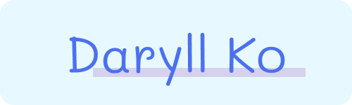

  

  
  
  

 

<h2>🙍🏻‍♂️ Hi! I'm Daryll.</h2>

I'm a CS student specializing in web development (primarily frontend) and theoretical CS (theory of computation, algorithms & data structures).

My life philosophy is all about simplicity and organization, and I use what I learn to continuously develop this.

I also love writing, metacognition, and Japanese culture. Coding is cool, but these have made the experience even cooler!

Anyways, I could go on and on about any of these, but I think it'd be better to let you take a look around for yourself.

Life is about enjoying the journey, and I hope this place gives you a glimpse of how I do so! ꒰ ･‿･๑ ꒱

 

<h2>⚙️ Tech Stack</h2>

I like to keep my primary toolbelt (★) small, but I <i>am</i> familiar with a lot of things.

 

  <h3>Systems / Coding Challenges</h3>
  
  

 

  <h3>Web Development</h3>
  

    
  

  

    
    
    
  

  

    
    
  

  

    
    
  

  

    
    
  

  

    
    
  

  

    
  

  

    
    
  

  

    
    
  

 

  <h3>Meta</h3>
  
  

 

  <h3>Others</h3>
  
  
  

 

<h2>📌 Pins (under maintenance)</h2>

Creations that I'm especially proud of!

 

<table>
  <tr>
    <td width="50%">
      <h3 align="center">Voltorb Flip</h3>
       
      
      

        
        
      

       
      

        
        
        
      

      
Voltorb Flip!

    </td>
    <td width="50%">
      <h3 align="center">Poké-Man</h3>
       
      
      

        
        
      

       
      

        
        
        
      

      
Poké-Man!

    </td>
  </tr>
  <tr>
    <td width="50%">
      <h3 align="center">RecProg</h3>
       
      
      

        
        
      

       
      

        
      

      
My recreational programming library!

    </td>
    <td width="50%">
      <h3 align="center">AutoMaker</h3>
       
      
      

        
        
      

       
      

        
        
        
      

      
AutoMaker!

    </td>
  </tr>
</table>
