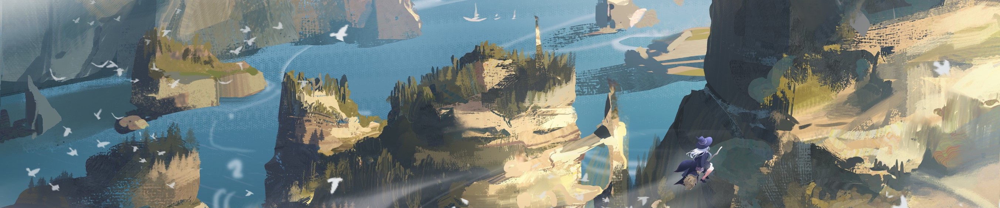

  

 

「話はまだまだ続く。続くったら続く！」

<h2>🙍🏻‍♂️ Hi! I'm Daryll.</h2>

I'm a computer science student who finds the math and language parts of CS fascinating. I currently serve as an intern in one of my department's research laboratories: I investigate models of computation inspired by biology and write software to streamline these investigations. I also help out in some of my department's courses, and dabble in a bit of web development on the side when I feel like it.

Aside from toying with code, I really like reading light novels and watching anime (I've been told I consume obscene amounts of these; oh well). I also get addicted to puzzle games and meta/philosophy articles from time to time. Oh, I also can't do sports for the life of me.

Life is about enjoying the journey, and I hope this place gives you a glimpse of how I do so! ^^

 

<h2>🔎 Where to find me</h2>

Click me!

 

✅ = I use it regularly, feel free to reach out!

❌ = I don't use it

✏️ = Circumstantial, check `Notes`

| `Platform`  | `Status` | `Notes`                                                            |
| ----------- | -------- | ------------------------------------------------------------------ |
| AniList     | ✅       | [`Daryll`](https://anilist.co/user/Daryll/)                        |
| Bookmeter   | ✅       | `ユイ`                                                             |
| Discord     | ✅       | `Daryll (_daryll_)`                                                |
| Email       | ✅       |                                                                    |
| Facebook    | ✏️       | I only use it for uni-related stuff and updating my profile, so... |
| GitHub      | ✅       |                                                                    |
| GitLab      | ❌       |                                                                    |
| Hacker News | ❌       |                                                                    |
| Instagram   | ❌       |                                                                    |
| LinkedIn    | ✏️       | I rarely use it                                                    |
| Mastodon    | ❌       |                                                                    |
| Messenger   | ✏️       | ✅ iff I know you                                                  |
| MyAnimeList | ❌       |                                                                    |
| Reddit      | ❌       |                                                                    |
| Steam       | ❌       |                                                                    |
| Threads     | ❌       |                                                                    |
| TikTok      | ❌       |                                                                    |
| Twitter     | ✅       | [`@daryll_ko`](https://twitter.com/daryll_ko)                      |

 

<h2>⚙️ Tech Stack</h2>

I use [Vim](https://www.vim.org/) as my editor and [kitty](https://sw.kovidgoyal.net/kitty/) as my terminal emulator. MacOS makes all the magic happen!

The tools I usually play with are in the dropdown below:

Click me!

 

  <h3>Web Development</h3>
  

    
  

  

    
    
  

  

    
    
  

  

    
    
  

  

    
    
  

  

    
    
  

  

    
  

  

    
    
  

  

    
  

 

  <h3>Scientific Computing & Data Science</h3>
  

    
    
  

 

  <h3>Systems Programming</h3>
  

    
    
    
  

 

  <h3>Functional Programming</h3>
  

    
  

