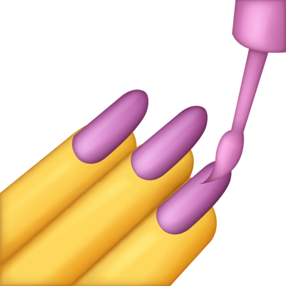
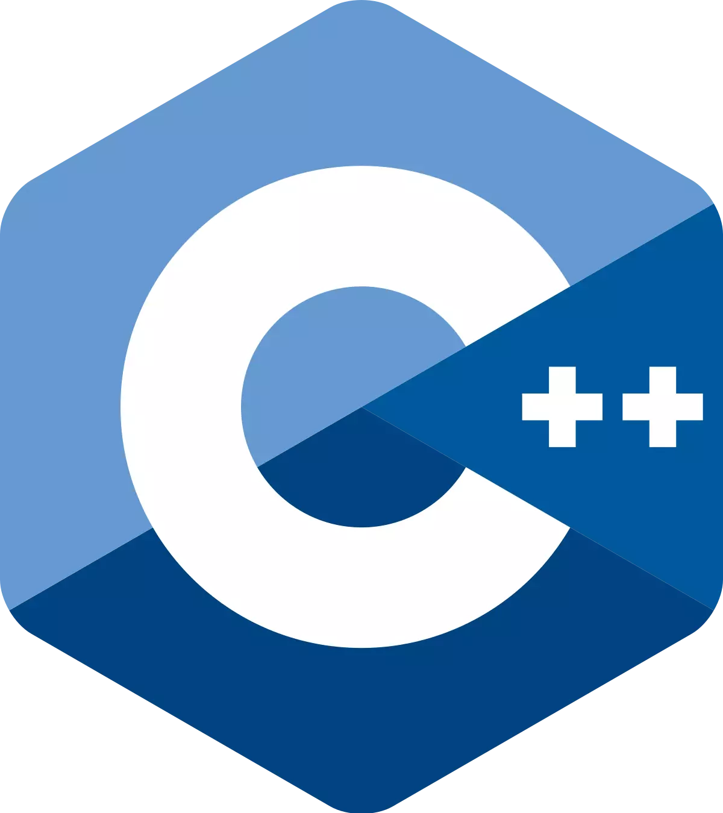

## 🙍🏻‍♂️ Hi! I'm Daryll.

  
  
  

 

I'm a fan of simple things.

I'll take anything that exhibits simplicity, really—computational problems that topple after a single key idea, stories that warm the heart through lovable characters, and philosophies that make life as tranquil of a journey as it can be.

But come on, life's pretty complex. Which brings us to what I like doing.

I'll happily play around with web technologies to make the online world a simpler and more meaningful place.

I'll eagerly learn theoretical topics in math and computer science to make the problem-solving process as simple as it can be.

I'll gleefully watch and read fictional tales to see reality as the ultimate form of simplicity.

Doing all of this sounds complex in and of itself, but with frameworks, systems, and beliefs that facilitate the whole process, nothing stands in the way of hope and determination.

**Life is about enjoying one big, complex journey, and I hope this place gives you a glimpse of how I do so.**

## ⚙️ Tech Stack

If you haven't realized it yet, I like simplicity!

Here are the tools I use:

  <h3>General</h3>
  
  
  

 

  <h3>Web</h3>
  
  
  
  
  

 

  <h3>If I'm in the mood to</h3>
  
  
  
  

## 📌 Pins

Here are creations that I'm especially proud of!

   
  
  
   
   
  

    
    
    
    
    •〜•
    
    
    
  

   
  An attempt at creating a Pac-Man game that kinda spiralled out of control...
   
   
  •〜•
   
   
  
   
   
  My philosophy towards life is mostly based on essentialism; this is a mental framework I've curated using that philosophy!
   
   
  •〜•
   
   
  
   
   
  

    
    
  

   
  I <i>love</i> coding challenges! I do competitive programming—without the 'competitive' part—as a hobby.

